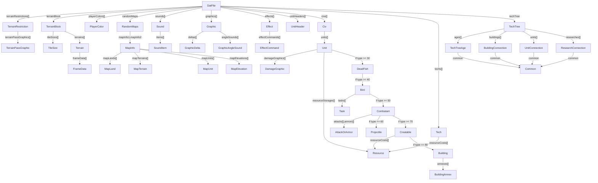

# `.dat` File Format Specification <!-- omit from toc -->

<details>
<summary>Table of Contents</summary>

- [Overview](#overview)
- [Null \& Empty Values](#null--empty-values)
- [Structure Relationships](#structure-relationships)
- [Core File Structures](#core-file-structures)
  - [`DatFile`](#datfile)
  - [`Version`](#version)
- [Graphics \& Sound](#graphics--sound)
  - [`Graphic`](#graphic)
  - [`GraphicDelta`](#graphicdelta)
  - [`GraphicAngleSound`](#graphicanglesound)
  - [`Sound`](#sound)
  - [`SoundItem`](#sounditem)
  - [`PlayerColor`](#playercolor)
- [Terrain](#terrain)
  - [`TerrainBlock`](#terrainblock)
  - [`TerrainRestriction`](#terrainrestriction)
  - [`TerrainPassGraphic`](#terrainpassgraphic)
  - [`Terrain`](#terrain-1)
  - [`FrameData`](#framedata)
  - [`TileSize`](#tilesize)
- [Research](#research)
  - [`Tech`](#tech)
  - [`Resource`](#resource)
- [Civilization](#civilization)
  - [`Civ`](#civ)
- [Unit](#unit)
  - [`Unit`](#unit-1)
  - [`DeadFish`](#deadfish)
  - [`Bird`](#bird)
  - [`Combatant`](#combatant)
  - [`Projectile`](#projectile)
  - [`Creatable`](#creatable)
  - [`Building`](#building)
  - [`BuildingAnnex`](#buildingannex)
  - [`DamageGraphic`](#damagegraphic)
  - [`Task`](#task)
  - [`UnitHeader`](#unitheader)
  - [`AttackOrArmor`](#attackorarmor)
- [Tech Tree](#tech-tree)
  - [`TechTree`](#techtree)
  - [`TechTreeAge`](#techtreeage)
  - [`Common`](#common)
  - [`BuildingConnection`](#buildingconnection)
  - [`UnitConnection`](#unitconnection)
  - [`ResearchConnection`](#researchconnection)
- [Map Generation](#map-generation)
  - [`RandomMaps`](#randommaps)
  - [`MapInfo`](#mapinfo)
  - [`MapLand`](#mapland)
  - [`MapTerrain`](#mapterrain)
  - [`MapUnit`](#mapunit)
  - [`MapElevation`](#mapelevation)
- [Effects](#effects)
  - [`Effect`](#effect)
  - [`EffectCommand`](#effectcommand)
- [Utility](#utility)
  - [`DebugString`](#debugstring)
- [Constants](#constants)
- [Version Differences](#version-differences)
  - [`Bird` Structure](#bird-structure)
- [Notes](#notes)

</details>

## Overview

Binary file formats store data as sequences of bytes rather than human-readable text. Unlike text formats like JSON or XML, binary formats are designed for efficient storage and processing. Binary formats typically define strict structures that specify the exact size and layout of each data field, often using fixed-width integers, floating point numbers, and length-prefixed strings.

The `.dat` file format is a binary format used to store game data and assets. It employs a compressed binary structure where the data is compressed using `zlib` compression (with negative window bits -15) before being written to disk. After decompression, the binary data follows a hierarchical structure that defines various game elements like terrain, graphics, sounds, civilizations, technologies, and units (and their many stats!).

Each field in the format has a specific type and size - for example, 8-bit integers (1 byte), 16-bit integers (2 bytes), 32-bit integers (4 bytes), and 32-bit floating point numbers (4 bytes). Strings are stored with a length prefix followed by UTF-8 encoded text. Arrays similarly begin with their length count followed by their elements. The format uses little-endian byte ordering for multi-byte values.

The format has evolved across multiple versions (from 7.1 to 7.8), with each version potentially adding new fields or modifying existing structures. Runtime pointers are preserved in the file format to maintain compatibility with the game engine, though these values are typically only meaningful during game execution.

This specification documents the complete binary structure, data types, and version differences to enable accurate reading and writing of `.dat` files.

## Null & Empty Values

- Numeric fields: 0 indicates `null`/unset
- Strings: Length of 0 indicates empty string
- Arrays: Length of 0 indicates empty array
- Pointers: 0 indicates `null` pointer
- `Resource`: `Resource.used` value of 0 indicates unused resource entry

## Structure Relationships



## Core File Structures

### `DatFile`

Root container for all game data and assets.

| Field                        | Type                                                                 | Description                     | Notes                                             |
| ---------------------------- | -------------------------------------------------------------------- | ------------------------------- | ------------------------------------------------- |
| `version`                    | [`Version`](#version)                                                | Version string (e.g. "VER 7.8") |                                                   |
| `terrainRestrictionsSize`    | `int16`                                                              | Number of terrain restrictions  |                                                   |
| `terrainsUsed`               | `int16`                                                              | Number of terrain types         |                                                   |
| `floatPtrTerrainTables`      | `int32[terrainRestrictionsSize]`                                     | Terrain table pointers          | Runtime pointers                                  |
| `terrainPassGraphicPointers` | `int32[terrainRestrictionsSize]`                                     | Terrain pass graphic pointers   | Runtime pointers                                  |
| `terrainRestrictions`        | [`TerrainRestriction[terrainRestrictionsSize]`](#terrainrestriction) | Terrain restrictions            | Requires `terrainsUsed` for parsing               |
| `playerColorsSize`           | `int16`                                                              | Number of player colors         |                                                   |
| `playerColors`               | [`PlayerColor[playerColorsSize]`](#playercolor)                      | Player color definitions        |                                                   |
| `soundsSize`                 | `int16`                                                              | Number of sounds                |                                                   |
| `sounds`                     | [`Sound[soundsSize]`](#sound)                                        | Sound definitions               |                                                   |
| `graphicsSize`               | `int16`                                                              | Number of graphics              |                                                   |
| `graphicPointers`            | `int32[graphicsSize]`                                                | Graphics pointers               | Used to determine if graphics array entries exist |
| `graphics`                   | [`Graphic[graphicsSize]`](#graphic)                                  | Graphics                        | Only present if corresponding pointer is non-zero |
| `terrainBlock`               | [`TerrainBlock`](#terrainblock)                                      | Terrain data                    |                                                   |
| `randomMaps`                 | [`RandomMaps`](#randommaps)                                          | Random map data                 |                                                   |
| `effectsSize`                | `int32`                                                              | Number of effects               |                                                   |
| `effects`                    | [`Effect[effectsSize]`](#effect)                                     |                                 |                                                   |
| `unitHeadersSize`            | `int32`                                                              | Number of unit headers          |                                                   |
| `unitHeaders`                | [`UnitHeader[unitHeadersSize]`](#unitheader)                         |                                 |                                                   |
| `civsSize`                   | `int16`                                                              | Number of civilizations         |                                                   |
| `civs`                       | [`Civ[civsSize]`](#civ)                                              | Civilization data               |                                                   |
| `techsSize`                  | `int16`                                                              | Number of technologies          |                                                   |
| `techs`                      | [`Tech[techsSize]`](#tech)                                           | Researchable technologies       |                                                   |
| `timeSlice`                  | `int32`                                                              |                                 |                                                   |
| `unitKillRate`               | `int32`                                                              |                                 |                                                   |
| `unitKillTotal`              | `int32`                                                              |                                 |                                                   |
| `unitHitPointRate`           | `int32`                                                              |                                 |                                                   |
| `unitHitPointTotal`          | `int32`                                                              |                                 |                                                   |
| `razingKillRate`             | `int32`                                                              |                                 |                                                   |
| `razingKillTotal`            | `int32`                                                              |                                 |                                                   |
| `techTree`                   | `TechTree`                                                           |                                 |                                                   |

### `Version`

`.dat` file format version identifier. Stored as an 8-byte string.

Known versions:

- `VER 7.1`
- `VER 7.2`
- `VER 7.3`
- `VER 7.4`
- `VER 7.5`
- `VER 7.6`
- `VER 7.7`
- `VER 7.8`

See [Version Differences](#version-differences) for information on how specific versions change the spec.

## Graphics & Sound

### `Graphic`

Visual asset definition including sprites, animations and effects.

| Field                  | Type                                                  | Notes                            |
| ---------------------- | ----------------------------------------------------- | -------------------------------- |
| `name`                 | [`DebugString`](#debugstring)                         |                                  |
| `fileName`             | [`DebugString`](#debugstring)                         |                                  |
| `particleEffectName`   | [`DebugString`](#debugstring)                         |                                  |
| `slp`                  | `int32`                                               |                                  |
| `isLoaded`             | `int8`                                                |                                  |
| `oldColorFlag`         | `int8`                                                |                                  |
| `layer`                | `int8`                                                |                                  |
| `playerColor`          | `int16`                                               |                                  |
| `transparentSelection` | `int8`                                                |                                  |
| `coordinates`          | `int16[4]`                                            |                                  |
| `deltaCount`           | `int16`                                               |                                  |
| `soundId`              | `int16`                                               |                                  |
| `wwiseSoundId`         | `int32`                                               |                                  |
| `angleSoundsUsed`      | `int8`                                                |                                  |
| `frameCount`           | `int16`                                               |                                  |
| `angleCount`           | `int16`                                               |                                  |
| `speedMultiplier`      | `float`                                               |                                  |
| `frameDuration`        | `float`                                               |                                  |
| `replayDelay`          | `float`                                               |                                  |
| `sequenceType`         | `int8`                                                |                                  |
| `id`                   | `int16`                                               |                                  |
| `mirroringMode`        | `int8`                                                |                                  |
| `editorFlag`           | `int8`                                                |                                  |
| `deltas`               | [`GraphicDelta[deltaCount]`](#graphicdelta)           |                                  |
| `angleSounds`          | [`GraphicAngleSound[angleCount]`](#graphicanglesound) | `null` if `angleSoundsUsed` is 0 |

### `GraphicDelta`

Sprite modification data for unit variations.

| Field          | Type    |
| -------------- | ------- |
| `graphicId`    | `int16` |
| `padding1`     | `int16` |
| `spritePtr`    | `int32` |
| `offsetX`      | `int16` |
| `offsetY`      | `int16` |
| `displayAngle` | `int16` |
| `padding2`     | `int16` |

### `GraphicAngleSound`

Sound effects for different animation angles.

| Field           | Type    |
| --------------- | ------- |
| `frameNum`      | `int16` |
| `soundId`       | `int16` |
| `wwiseSoundId`  | `int32` |
| `frameNum2`     | `int16` |
| `soundId2`      | `int16` |
| `wwiseSoundId2` | `int32` |
| `frameNum3`     | `int16` |
| `soundId3`      | `int16` |
| `wwiseSoundId3` | `int32` |

### `Sound`

Audio asset with multiple possible variations.

| Field              | Type                                 |
| ------------------ | ------------------------------------ |
| `id`               | `int16`                              |
| `playDelay`        | `int16`                              |
| `itemsSize`        | `int16`                              |
| `cacheTime`        | `int32`                              |
| `totalProbability` | `int16`                              |
| `items`            | [`SoundItem[itemsSize]`](#sounditem) |

### `SoundItem`

Individual sound file with playback properties.

| Field          | Type                          |
| -------------- | ----------------------------- |
| `filename`     | [`DebugString`](#debugstring) |
| `resourceId`   | `int32`                       |
| `probability`  | `int16`                       |
| `civilization` | `int16`                       |
| `iconSet`      | `int16`                       |

### `PlayerColor`

Color palette definition for player-owned units.

| Field                 | Type    |
| --------------------- | ------- |
| `id`                  | `int32` |
| `playerColorBase`     | `int32` |
| `unitOutlineColor`    | `int32` |
| `unitSelectionColor1` | `int32` |
| `unitSelectionColor2` | `int32` |
| `minimapColor`        | `int32` |
| `minimapColor2`       | `int32` |
| `minimapColor3`       | `int32` |
| `statisticsText`      | `int32` |

## Terrain

### `TerrainBlock`

Container for terrain data and rendering properties.

| Field                | Type                                     |
| -------------------- | ---------------------------------------- |
| `virtualFunctionPtr` | `uint32`                                 |
| `mapPointer`         | `uint32`                                 |
| `mapWidth`           | `int32`                                  |
| `mapHeight`          | `int32`                                  |
| `worldWidth`         | `int32`                                  |
| `worldHeight`        | `int32`                                  |
| `tileSizes`          | [`TileSize[TILE_TYPE_COUNT]`](#tilesize) |
| `paddingTs`          | `int16`                                  |
| `terrains`           | [`Terrain[TERRAIN_COUNT]`](#terrain)     |
| `mapMinX`            | `float`                                  |
| `mapMinY`            | `float`                                  |
| `mapMaxX`            | `float`                                  |
| `mapMaxY`            | `float`                                  |
| `mapMaxXPlus1`       | `float`                                  |
| `mapMaxYPlus1`       | `float`                                  |
| `terrainsUsed2`      | `int16`                                  |
| `bordersUsed`        | `int16`                                  |
| `maxTerrain`         | `int16`                                  |
| `tileWidth`          | `int16`                                  |
| `tileHeight`         | `int16`                                  |
| `tileHalfHeight`     | `int16`                                  |
| `tileHalfWidth`      | `int16`                                  |
| `elevHeight`         | `int16`                                  |
| `curRow`             | `int16`                                  |
| `curCol`             | `int16`                                  |
| `blockBegRow`        | `int16`                                  |
| `blockEndRow`        | `int16`                                  |
| `blockBegCol`        | `int16`                                  |
| `blockEndCol`        | `int16`                                  |
| `searchMapPtr`       | `uint32`                                 |
| `searchMapRowsPtr`   | `uint32`                                 |
| `anyFrameChange`     | `int8`                                   |
| `mapVisibleFlag`     | `int8`                                   |
| `fogFlag`            | `int8`                                   |

### `TerrainRestriction`

Movement and placement rules for terrain types.

| Field                            | Type                                                      |
| -------------------------------- | --------------------------------------------------------- |
| `passableBuildableDmgMultiplier` | `float[terrainsUsed]`                                     |
| `terrainPassGraphics`            | [`TerrainPassGraphic[terrainsUsed]`](#terrainpassgraphic) |

### `TerrainPassGraphic`

Visual effects for units moving through terrain.

| Field               | Type    |
| ------------------- | ------- |
| `exitTileSpriteId`  | `int32` |
| `enterTileSpriteId` | `int32` |
| `walkTileSpriteId`  | `int32` |
| `walkSpriteRate`    | `int32` |

### `Terrain`

Definition of terrain type with graphics and properties.

| Field                      | Type                                       |
| -------------------------- | ------------------------------------------ |
| `enabled`                  | `int8`                                     |
| `random`                   | `int8`                                     |
| `isWater`                  | `int8`                                     |
| `hideInEditor`             | `int8`                                     |
| `stringId`                 | `int32`                                    |
| `name`                     | [`DebugString`](#debugstring)              |
| `name2`                    | [`DebugString`](#debugstring)              |
| `slp`                      | `int32`                                    |
| `shapePtr`                 | `int32`                                    |
| `soundId`                  | `int32`                                    |
| `wwiseSoundId`             | `int32`                                    |
| `wwiseSoundStopId`         | `int32`                                    |
| `blendPriority`            | `int32`                                    |
| `blendType`                | `int32`                                    |
| `overlayMaskName`          | [`DebugString`](#debugstring)              |
| `colors`                   | `int8[3]`                                  |
| `cliffColors`              | `int8[2]`                                  |
| `passableTerrain`          | `int8`                                     |
| `impassableTerrain`        | `int8`                                     |
| `isAnimated`               | `int8`                                     |
| `animationFrames`          | `int16`                                    |
| `pauseFrames`              | `int16`                                    |
| `interval`                 | `float`                                    |
| `pauseBetweenLoops`        | `float`                                    |
| `frame`                    | `int16`                                    |
| `drawFrame`                | `int16`                                    |
| `animateLast`              | `float`                                    |
| `frameChanged`             | `int8`                                     |
| `drawn`                    | `int8`                                     |
| `frameData`                | [`FrameData[TILE_TYPE_COUNT]`](#framedata) |
| `terrainToDraw`            | `int16`                                    |
| `terrainDimensions`        | `int16[2]`                                 |
| `terrainUnitMaskedDensity` | `int16[TERRAIN_UNITS_SIZE]`                |
| `terrainUnitId`            | `int16[TERRAIN_UNITS_SIZE]`                |
| `terrainUnitDensity`       | `int16[TERRAIN_UNITS_SIZE]`                |
| `terrainUnitCentering`     | `int8[TERRAIN_UNITS_SIZE]`                 |
| `numberOfTerrainUnitsUsed` | `int16`                                    |
| `phantom`                  | `int16`                                    |

### `FrameData`

Animation frame counts for terrain tiles.

| Field        | Type    |
| ------------ | ------- |
| `frameCount` | `int16` |
| `angleCount` | `int16` |
| `shapeId`    | `int16` |

### `TileSize`

Dimensions for terrain tile rendering.

| Field    | Type    |
| -------- | ------- |
| `width`  | `int16` |
| `height` | `int16` |
| `deltaY` | `int16` |

## Research

### `Tech`

Researchable upgrade definition.

| Field                    | Type                          |
| ------------------------ | ----------------------------- |
| `requiredTechs`          | `int16[6]`                    |
| `resourceCosts`          | [`Resource[3]`](#resource)    |
| `requiredTechCount`      | `int16`                       |
| `civ`                    | `int16`                       |
| `fullTechMode`           | `int16`                       |
| `researchLocation`       | `int16`                       |
| `languageDllName`        | `int32`                       |
| `languageDllDescription` | `int32`                       |
| `researchTime`           | `int16`                       |
| `effectId`               | `int16`                       |
| `type`                   | `int16`                       |
| `iconId`                 | `int16`                       |
| `buttonId`               | `int8`                        |
| `languageDllHelp`        | `int32`                       |
| `languageDllTechTree`    | `int32`                       |
| `hotKey`                 | `int32`                       |
| `name`                   | [`DebugString`](#debugstring) |
| `repeatable`             | `int8`                        |

### `Resource`

Resource cost or capacity definition.

| Field    | Type    | Description                  |
| -------- | ------- | ---------------------------- |
| `type`   | `int16` |                              |
| `amount` | `int16` |                              |
| `used`   | `int8`  | Whether the resource is used |

## Civilization

### `Civ`

Civilization-specific unit and tech modifications.

| Field           | Type                          | Notes                                                |
| --------------- | ----------------------------- | ---------------------------------------------------- |
| `playerType`    | `int8`                        |                                                      |
| `name`          | [`DebugString`](#debugstring) |                                                      |
| `resourcesSize` | `int16`                       |                                                      |
| `techTreeId`    | `int16`                       |                                                      |
| `teamBonusId`   | `int16`                       |                                                      |
| `resources`     | `float[resourcesSize]`        |                                                      |
| `iconSet`       | `int8`                        |                                                      |
| `unitsSize`     | `int16`                       |                                                      |
| `unitPointers`  | `int32[unitsSize]`            |                                                      |
| `units`         | [`Unit[unitsSize]`](#unit)    | Each unit only present if corresponding pointer is 1 |

## Unit

The `.dat` format uses an inheritance-based unit system where each unit type builds upon a base set of attributes. Units are defined by their `type` field, which determines their inheritance chain:

- Base `Unit`: Core attributes like HP, graphics, sounds
- `DeadFish` (`type` >= 30): Adds movement and rotation
- `Bird` (`type` >= 40): Adds tasks and search behavior
- `Combatant` (`type` >= 50): Adds combat stats and damage
- `Projectile` (`type` == 60): Specialized combat unit with projectile physics
- `Creatable` (`type` >= 70): Adds training and resource costs
- `Building` (`type` == 80): Adds construction and garrison abilities

Each derived type inherits all fields from its parent types. For example, `Building` includes all fields from `Unit` through `Creatable`, plus building-specific fields.

```mermaid
classDiagram
    Unit <|-- DeadFish
    DeadFish <|-- Bird
    Bird <|-- Combatant
    Combatant <|-- Projectile
    Combatant <|-- Creatable
    Creatable <|-- Building

    class Unit{
        +type: int8
        +id: int16
        +languageDllName: int32
        +languageDllCreation: int32
        +class: int16
        +standingGraphic: int16[2]
        +dyingGraphic: int16
        +undeadGraphic: int16
        +undeadMode: int8
        +hitPoints: int16
        +lineOfSight: float
        +garrisonCapacity: int8
        +collisionSizeX: float
        +collisionSizeY: float
        +collisionSizeZ: float
        +trainSound: int16
        +damageSound: int16
        +deadUnitId: int16
        +bloodUnitId: int16
        +sortNumber: int8
        +canBeBuiltOn: int8
        +iconId: int16
        +hideInEditor: int8
        +oldPortraitPict: int16
        +enabled: int8
        +disabled: int8
        +placementSideTerrain: int16[2]
        +placementTerrain: int16[2]
        +clearanceSize: float[2]
        +hillMode: int8
        +fogVisibility: int8
        +terrainRestriction: int16
        +flyMode: int8
        +resourceCapacity: int16
        +resourceDecay: float
        +blastDefenseLevel: int8
        +combatLevel: int8
        +interactionMode: int8
        +minimapMode: int8
        +interfaceKind: int8
        +multipleAttributeMode: float
        +minimapColor: int8
        +languageDllHelp: int32
        +languageDllHotkeyText: int32
        +hotKey: int32
        +recyclable: int8
        +enableAutoGather: int8
        +createDoppelgangerOnDeath: int8
        +resourceGatherGroup: int8
        +occlusionMode: int8
        +obstructionType: int8
        +obstructionClass: int8
        +trait: int8
        +civilization: int8
        +nothing: int16
        +selectionEffect: int8
        +editorSelectionColor: int8
        +outlineSizeX: float
        +outlineSizeY: float
        +outlineSizeZ: float
        +resourceStorages: Resource[3]
        +damageGraphics: DamageGraphic[]
        +selectionSound: int16
        +dyingSound: int16
        +wwiseTrainSoundId: int32
        +wwiseDamageSoundId: int32
        +wwiseSelectionSoundId: int32
        +wwiseDyingSoundId: int32
        +oldAttackReaction: int8
        +convertTerrain: int8
        +name: DebugString
        +copyId: int16
        +baseId: int16
        +speed: float
    }
    class DeadFish{
        +walkingGraphic: int16
        +runningGraphic: int16
        +rotationSpeed: float
        +oldSizeClass: int8
        +trackingUnit: int16
        +trackingUnitMode: int8
        +trackingUnitDensity: float
        +oldMoveAlgorithm: int8
        +turnRadius: float
        +turnRadiusSpeed: float
        +maxYawPerSecondMoving: float
        +stationaryYawRevolutionTime: float
        +maxYawPerSecondStationary: float
        +minCollisionSizeMultiplier: float
    }
    class Bird{
        +defaultTaskId: int16
        +searchRadius: float
        +workRate: float
        +dropSites: int16[]
        +taskSwapGroup: int8
        +attackSound: int16
        +moveSound: int16
        +wwiseAttackSoundId: int32
        +wwiseMoveSoundId: int32
        +runPattern: int8
        +tasks: Task[]
    }
    class Combatant{
        +baseArmor: int16
        +attacks: AttackOrArmor[]
        +armors: AttackOrArmor[]
        +defenseTerrainBonus: int16
        +bonusDamageResistance: float
        +maxRange: float
        +blastWidth: float
        +reloadTime: float
        +projectileUnitId: int16
        +accuracyPercent: int16
        +breakOffCombat: int8
        +frameDelay: int16
        +graphicDisplacement: float[3]
        +blastAttackLevel: int8
        +minRange: float
        +accuracyDispersion: float
        +attackGraphic: int16
        +displayedMeleeArmor: int16
        +displayedAttack: int16
        +displayedRange: float
        +displayedReloadTime: float
        +blastDamage: float
    }
    class Projectile{
        +projectileType: int8
        +smartMode: int8
        +hitMode: int8
        +vanishMode: int8
        +areaEffectSpecials: int8
        +projectileArc: float
    }
    class Creatable{
        +resourceCosts: Resource[3]
        +trainTime: int16
        +trainLocationId: int16
        +buttonId: int8
        +rearAttackModifier: float
        +flankAttackModifier: float
        +creatableType: int8
        +heroMode: int8
        +garrisonGraphic: int32
        +spawningGraphic: int16
        +upgradeGraphic: int16
        +heroGlowGraphic: int16
        +maxCharge: float
        +rechargeRate: float
        +chargeEvent: int16
        +chargeType: int16
        +minConversionTimeMod: float
        +maxConversionTimeMod: float
        +conversionChanceMod: float
        +totalProjectiles: float
        +maxTotalProjectiles: int8
        +projectileSpawningArea: float[3]
        +secondaryProjectileUnit: int32
        +specialGraphic: int32
        +specialAbility: int8
        +displayedPierceArmor: int16
    }
    class Building{
        +constructionGraphicId: int16
        +snowGraphicId: int16
        +destructionGraphicId: int16
        +destructionRubbleGraphicId: int16
        +researchingGraphic: int16
        +researchCompletedGraphic: int16
        +adjacentMode: int8
        +graphicsAngle: int16
        +disappearsWhenBuilt: int8
        +stackUnitId: int16
        +foundationTerrainId: int16
        +oldOverlapId: int16
        +techId: int16
        +canBurn: int8
        +annexes: BuildingAnnex[4]
        +headUnit: int16
        +transformUnit: int16
        +transformSound: int16
        +constructionSound: int16
        +wwiseTransformSoundId: int32
        +wwiseConstructionSoundId: int32
        +garrisonType: int8
        +garrisonHealRate: float
        +garrisonRepairRate: float
        +pileUnit: int16
        +lootingTable: int8[6]
    }
```

<details>
<summary>Unit inheritance diagram</summary>



</details>

### `Unit`

Base entity definition with common properties.

| Field                       | Type                                                  | Notes                               |
| --------------------------- | ----------------------------------------------------- | ----------------------------------- |
| `type`                      | `int8`                                                | Determines derived unit type fields |
| `id`                        | `int16`                                               |                                     |
| `languageDllName`           | `int32`                                               |                                     |
| `languageDllCreation`       | `int32`                                               |                                     |
| `class`                     | `int16`                                               |                                     |
| `standingGraphic`           | `int16[2]`                                            |                                     |
| `dyingGraphic`              | `int16`                                               |                                     |
| `undeadGraphic`             | `int16`                                               |                                     |
| `undeadMode`                | `int8`                                                |                                     |
| `hitPoints`                 | `int16`                                               |                                     |
| `lineOfSight`               | `float`                                               |                                     |
| `garrisonCapacity`          | `int8`                                                |                                     |
| `collisionSizeX`            | `float`                                               |                                     |
| `collisionSizeY`            | `float`                                               |                                     |
| `collisionSizeZ`            | `float`                                               |                                     |
| `trainSound`                | `int16`                                               |                                     |
| `damageSound`               | `int16`                                               |                                     |
| `deadUnitId`                | `int16`                                               |                                     |
| `bloodUnitId`               | `int16`                                               |                                     |
| `sortNumber`                | `int8`                                                |                                     |
| `canBeBuiltOn`              | `int8`                                                |                                     |
| `iconId`                    | `int16`                                               |                                     |
| `hideInEditor`              | `int8`                                                |                                     |
| `oldPortraitPict`           | `int16`                                               |                                     |
| `enabled`                   | `int8`                                                |                                     |
| `disabled`                  | `int8`                                                |                                     |
| `placementSideTerrain`      | `int16[2]`                                            |                                     |
| `placementTerrain`          | `int16[2]`                                            |                                     |
| `clearanceSize`             | `float[2]`                                            |                                     |
| `hillMode`                  | `int8`                                                |                                     |
| `fogVisibility`             | `int8`                                                |                                     |
| `terrainRestriction`        | `int16`                                               |                                     |
| `flyMode`                   | `int8`                                                |                                     |
| `resourceCapacity`          | `int16`                                               |                                     |
| `resourceDecay`             | `float`                                               |                                     |
| `blastDefenseLevel`         | `int8`                                                |                                     |
| `combatLevel`               | `int8`                                                |                                     |
| `interactionMode`           | `int8`                                                |                                     |
| `minimapMode`               | `int8`                                                |                                     |
| `interfaceKind`             | `int8`                                                |                                     |
| `multipleAttributeMode`     | `float`                                               |                                     |
| `minimapColor`              | `int8`                                                |                                     |
| `languageDllHelp`           | `int32`                                               |                                     |
| `languageDllHotkeyText`     | `int32`                                               |                                     |
| `hotKey`                    | `int32`                                               |                                     |
| `recyclable`                | `int8`                                                |                                     |
| `enableAutoGather`          | `int8`                                                |                                     |
| `createDoppelgangerOnDeath` | `int8`                                                |                                     |
| `resourceGatherGroup`       | `int8`                                                |                                     |
| `occlusionMode`             | `int8`                                                |                                     |
| `obstructionType`           | `int8`                                                |                                     |
| `obstructionClass`          | `int8`                                                |                                     |
| `trait`                     | `int8`                                                |                                     |
| `civilization`              | `int8`                                                |                                     |
| `nothing`                   | `int16`                                               |                                     |
| `selectionEffect`           | `int8`                                                |                                     |
| `editorSelectionColor`      | `int8`                                                |                                     |
| `outlineSizeX`              | `float`                                               |                                     |
| `outlineSizeY`              | `float`                                               |                                     |
| `outlineSizeZ`              | `float`                                               |                                     |
| `scenarioTriggers1`         | `int32`                                               |                                     |
| `scenarioTriggers2`         | `int32`                                               |                                     |
| `resourceStorages`          | [`Resource[3]`](#resource)                            |                                     |
| `damageGraphicCount`        | `int8`                                                |                                     |
| `damageGraphics`            | [`DamageGraphic[damageGraphicCount]`](#damagegraphic) |                                     |
| `selectionSound`            | `int16`                                               |                                     |
| `dyingSound`                | `int16`                                               |                                     |
| `wwiseTrainSoundId`         | `int32`                                               |                                     |
| `wwiseDamageSoundId`        | `int32`                                               |                                     |
| `wwiseSelectionSoundId`     | `int32`                                               |                                     |
| `wwiseDyingSoundId`         | `int32`                                               |                                     |
| `oldAttackReaction`         | `int8`                                                |                                     |
| `convertTerrain`            | `int8`                                                |                                     |
| `name`                      | [`DebugString`](#debugstring)                         |                                     |
| `copyId`                    | `int16`                                               |                                     |
| `baseId`                    | `int16`                                               |                                     |
| `speed`                     | `float`                                               | Only if `type` >= 20                |
| `deadFish`                  | [`DeadFish`](#deadfish)                               | Only if `type` >= 30                |
| `bird`                      | [`Bird`](#bird)                                       | Only if `type` >= 40                |
| `combatant`                 | [`Combatant`](#combatant)                             | Only if `type` >= 50                |
| `projectile`                | [`Projectile`](#projectile)                           | Only if `type` == 60                |
| `creatable`                 | [`Creatable`](#creatable)                             | Only if `type` >= 70                |
| `building`                  | [`Building`](#building)                               | Only if `type` == 80                |

### `DeadFish`

Adds movement and tracking capabilities.

| Field                         | Type    |
| ----------------------------- | ------- |
| `walkingGraphic`              | `int16` |
| `runningGraphic`              | `int16` |
| `rotationSpeed`               | `float` |
| `oldSizeClass`                | `int8`  |
| `trackingUnit`                | `int16` |
| `trackingUnitMode`            | `int8`  |
| `trackingUnitDensity`         | `float` |
| `oldMoveAlgorithm`            | `int8`  |
| `turnRadius`                  | `float` |
| `turnRadiusSpeed`             | `float` |
| `maxYawPerSecondMoving`       | `float` |
| `stationaryYawRevolutionTime` | `float` |
| `maxYawPerSecondStationary`   | `float` |
| `minCollisionSizeMultiplier`  | `float` |

### `Bird`

Adds task processing and search behavior.

| Field                | Type                       | Notes                              |
| -------------------- | -------------------------- | ---------------------------------- |
| `defaultTaskId`      | `int16`                    |                                    |
| `searchRadius`       | `float`                    |                                    |
| `workRate`           | `float`                    |                                    |
| `dropSitesSize`      | `int16`                    | Only in `version` >= 7.8           |
| `dropSites`          | `int16[dropSitesSize]`     | Fixed size of 3 in `version` < 7.8 |
| `taskSwapGroup`      | `int8`                     |                                    |
| `attackSound`        | `int16`                    |                                    |
| `moveSound`          | `int16`                    |                                    |
| `wwiseAttackSoundId` | `int32`                    |                                    |
| `wwiseMoveSoundId`   | `int32`                    |                                    |
| `runPattern`         | `int8`                     |                                    |
| `taskCount`          | `int16`                    |                                    |
| `tasks`              | [`Task[taskCount]`](#task) |                                    |

### `Combatant`

Adds combat and damage capabilities.

| Field                   | Type                                           |
| ----------------------- | ---------------------------------------------- |
| `baseArmor`             | `int16`                                        |
| `attackCount`           | `int16`                                        |
| `attacks`               | [`AttackOrArmor[attackCount]`](#attackorarmor) |
| `armorCount`            | `int16`                                        |
| `armors`                | [`AttackOrArmor[armorCount]`](#attackorarmor)  |
| `defenseTerrainBonus`   | `int16`                                        |
| `bonusDamageResistance` | `float`                                        |
| `maxRange`              | `float`                                        |
| `blastWidth`            | `float`                                        |
| `reloadTime`            | `float`                                        |
| `projectileUnitId`      | `int16`                                        |
| `accuracyPercent`       | `int16`                                        |
| `breakOffCombat`        | `int8`                                         |
| `frameDelay`            | `int16`                                        |
| `graphicDisplacement`   | `float[3]`                                     |
| `blastAttackLevel`      | `int8`                                         |
| `minRange`              | `float`                                        |
| `accuracyDispersion`    | `float`                                        |
| `attackGraphic`         | `int16`                                        |
| `displayedMeleeArmor`   | `int16`                                        |
| `displayedAttack`       | `int16`                                        |
| `displayedRange`        | `float`                                        |
| `displayedReloadTime`   | `float`                                        |
| `blastDamage`           | `float`                                        |

### `Projectile`

Defines projectile physics and behavior.

| Field                | Type    |
| -------------------- | ------- |
| `projectileType`     | `int8`  |
| `smartMode`          | `int8`  |
| `hitMode`            | `int8`  |
| `vanishMode`         | `int8`  |
| `areaEffectSpecials` | `int8`  |
| `projectileArc`      | `float` |

### `Creatable`

Adds capabilities related to creatable entities, like training and resource requirements.

| Field                     | Type                       |
| ------------------------- | -------------------------- |
| `resourceCosts`           | [`Resource[3]`](#resource) |
| `trainTime`               | `int16`                    |
| `trainLocationId`         | `int16`                    |
| `buttonId`                | `int8`                     |
| `rearAttackModifier`      | `float`                    |
| `flankAttackModifier`     | `float`                    |
| `creatableType`           | `int8`                     |
| `heroMode`                | `int8`                     |
| `garrisonGraphic`         | `int32`                    |
| `spawningGraphic`         | `int16`                    |
| `upgradeGraphic`          | `int16`                    |
| `heroGlowGraphic`         | `int16`                    |
| `maxCharge`               | `float`                    |
| `rechargeRate`            | `float`                    |
| `chargeEvent`             | `int16`                    |
| `chargeType`              | `int16`                    |
| `minConversionTimeMod`    | `float`                    |
| `maxConversionTimeMod`    | `float`                    |
| `conversionChanceMod`     | `float`                    |
| `totalProjectiles`        | `float`                    |
| `maxTotalProjectiles`     | `int8`                     |
| `projectileSpawningArea`  | `float[3]`                 |
| `secondaryProjectileUnit` | `int32`                    |
| `specialGraphic`          | `int32`                    |
| `specialAbility`          | `int8`                     |
| `displayedPierceArmor`    | `int16`                    |

### `Building`

Defines building placement and capabilities.

| Field                        | Type                                 |
| ---------------------------- | ------------------------------------ |
| `constructionGraphicId`      | `int16`                              |
| `snowGraphicId`              | `int16`                              |
| `destructionGraphicId`       | `int16`                              |
| `destructionRubbleGraphicId` | `int16`                              |
| `researchingGraphic`         | `int16`                              |
| `researchCompletedGraphic`   | `int16`                              |
| `adjacentMode`               | `int8`                               |
| `graphicsAngle`              | `int16`                              |
| `disappearsWhenBuilt`        | `int8`                               |
| `stackUnitId`                | `int16`                              |
| `foundationTerrainId`        | `int16`                              |
| `oldOverlapId`               | `int16`                              |
| `techId`                     | `int16`                              |
| `canBurn`                    | `int8`                               |
| `annexes`                    | [`BuildingAnnex[4]`](#buildingannex) |
| `headUnit`                   | `int16`                              |
| `transformUnit`              | `int16`                              |
| `transformSound`             | `int16`                              |
| `constructionSound`          | `int16`                              |
| `wwiseTransformSoundId`      | `int32`                              |
| `wwiseConstructionSoundId`   | `int32`                              |
| `garrisonType`               | `int8`                               |
| `garrisonHealRate`           | `float`                              |
| `garrisonRepairRate`         | `float`                              |
| `pileUnit`                   | `int16`                              |
| `lootingTable`               | `int8[6]`                            |

### `BuildingAnnex`

Attached building component positioning.

| Field           | Type    |
| --------------- | ------- |
| `unitId`        | `int16` |
| `misplacementX` | `float` |
| `misplacementY` | `float` |

### `DamageGraphic`

Visual states for damaged units.

| Field           | Type    |
| --------------- | ------- |
| `graphicId`     | `int16` |
| `damagePercent` | `int16` |
| `applyMode`     | `int8`  |

### `Task`

Actionable behavior definition.

| Field                           | Type    |
| ------------------------------- | ------- |
| `taskType`                      | `int16` |
| `id`                            | `int16` |
| `isDefault`                     | `int8`  |
| `actionType`                    | `int16` |
| `classId`                       | `int16` |
| `unitId`                        | `int16` |
| `terrainId`                     | `int16` |
| `resourceIn`                    | `int16` |
| `resourceMultiplier`            | `int16` |
| `resourceOut`                   | `int16` |
| `unusedResource`                | `int16` |
| `workValue1`                    | `float` |
| `workValue2`                    | `float` |
| `workRange`                     | `float` |
| `autoSearchTargets`             | `int8`  |
| `searchWaitTime`                | `float` |
| `enableTargeting`               | `int8`  |
| `combatLevelFlag`               | `int8`  |
| `gatherType`                    | `int16` |
| `workFlag2`                     | `int16` |
| `targetDiplomacy`               | `int8`  |
| `carryCheck`                    | `int8`  |
| `pickForConstruction`           | `int8`  |
| `movingGraphicId`               | `int16` |
| `proceedingGraphicId`           | `int16` |
| `workingGraphicId`              | `int16` |
| `carryingGraphicId`             | `int16` |
| `resourceGatheringSoundId`      | `int16` |
| `resourceDepositSoundId`        | `int16` |
| `wwiseResourceGatheringSoundId` | `int32` |
| `wwiseResourceDepositSoundId`   | `int32` |

### `UnitHeader`

Container for unit task lists.

| Field       | Type              | Notes                                |
| ----------- | ----------------- | ------------------------------------ |
| `exists`    | `int8`            |                                      |
| `taskCount` | `int16`           | Only present if `exists` is non-zero |
| `taskList`  | `Task[taskCount]` | Only present if `exists` is non-zero |

### `AttackOrArmor`

Combat damage or protection value.

| Field    | Type    |
| -------- | ------- |
| `class`  | `int16` |
| `amount` | `int16` |

## Tech Tree

### `TechTree`

Tech tree UI layout container.

| Field                 | Type                                                       |
| --------------------- | ---------------------------------------------------------- |
| `ageCount`            | `int8`                                                     |
| `buildingCount`       | `int8`                                                     |
| `unitCount`           | `int8`                                                     |
| `researchCount`       | `int8`                                                     |
| `totalUnitTechGroups` | `int32`                                                    |
| `ages`                | [`TechTreeAge[ageCount]`](#techtreeage)                    |
| `buildings`           | [`BuildingConnection[buildingCount]`](#buildingconnection) |
| `units`               | [`UnitConnection[unitCount]`](#unitconnection)             |
| `researches`          | [`ResearchConnection[researchCount]`](#researchconnection) |

### `TechTreeAge`

Age advancement node properties.

| Field                | Type                    |
| -------------------- | ----------------------- |
| `id`                 | `int32`                 |
| `status`             | `int8`                  |
| `buildingsCount`     | `int8`                  |
| `buildings`          | `int32[buildingsCount]` |
| `unitsCount`         | `int8`                  |
| `units`              | `int32[unitsCount]`     |
| `techsCount`         | `int8`                  |
| `techs`              | `int32[techsCount]`     |
| `common`             | [`Common`](#common)     |
| `numBuildingLevels`  | `int8`                  |
| `buildingsPerZone`   | `int8[10]`              |
| `groupLengthPerZone` | `int8[10]`              |
| `maxAgeLength`       | `int8`                  |
| `lineMode`           | `int32`                 |

### `Common`

Shared tech tree node properties.

| Field          | Type        |
| -------------- | ----------- |
| `slotsUsed`    | `int32`     |
| `unitResearch` | `int32[10]` |
| `mode`         | `int32[10]` |

### `BuildingConnection`

Building node in the tech tree.

| Field              | Type                    |
| ------------------ | ----------------------- |
| `id`               | `int32`                 |
| `status`           | `int8`                  |
| `buildingsCount`   | `int8`                  |
| `buildings`        | `int32[buildingsCount]` |
| `unitsCount`       | `int8`                  |
| `units`            | `int32[unitsCount]`     |
| `techsCount`       | `int8`                  |
| `techs`            | `int32[techsCount]`     |
| `common`           | [`Common`](#common)     |
| `locationInAge`    | `int8`                  |
| `unitsTechsTotal`  | `int8[5]`               |
| `unitsTechsFirst`  | `int8[5]`               |
| `lineMode`         | `int32`                 |
| `enablingResearch` | `int32`                 |

### `UnitConnection`

Unit node in the tech tree.

| Field              | Type                |
| ------------------ | ------------------- |
| `id`               | `int32`             |
| `status`           | `int8`              |
| `upperBuilding`    | `int32`             |
| `common`           | [`Common`](#common) |
| `verticalLine`     | `int32`             |
| `unitsCount`       | `int8`              |
| `units`            | `int32[unitsCount]` |
| `locationInAge`    | `int32`             |
| `requiredResearch` | `int32`             |
| `lineMode`         | `int32`             |
| `enablingResearch` | `int32`             |

### `ResearchConnection`

Research node in the tech tree.

| Field            | Type                    |
| ---------------- | ----------------------- |
| `id`             | `int32`                 |
| `status`         | `int8`                  |
| `upperBuilding`  | `int32`                 |
| `buildingsCount` | `int8`                  |
| `buildings`      | `int32[buildingsCount]` |
| `unitsCount`     | `int8`                  |
| `units`          | `int32[unitsCount]`     |
| `techsCount`     | `int8`                  |
| `techs`          | `int32[techsCount]`     |
| `common`         | [`Common`](#common)     |
| `verticalLine`   | `int32`                 |
| `locationInAge`  | `int32`                 |
| `lineMode`       | `int32`                 |

## Map Generation

### `RandomMaps`

Random map script container.

| Field            | Type                                  |
| ---------------- | ------------------------------------- |
| `randomMapCount` | `int32`                               |
| `randomMapsPtr`  | `int32`                               |
| `mapInfo1`       | [`MapInfo[randomMapCount]`](#mapinfo) |
| `mapInfo2`       | [`MapInfo[randomMapCount]`](#mapinfo) |

### `MapInfo`

Map generation parameters.

| Field               | Type                                               |
| ------------------- | -------------------------------------------------- |
| `mapId`             | `int32`                                            |
| `borderSouthWest`   | `int32`                                            |
| `borderNorthWest`   | `int32`                                            |
| `borderNorthEast`   | `int32`                                            |
| `borderSouthEast`   | `int32`                                            |
| `borderUsage`       | `int32`                                            |
| `waterShape`        | `int32`                                            |
| `baseTerrain`       | `int32`                                            |
| `landCoverage`      | `int32`                                            |
| `unusedId`          | `int32`                                            |
| `mapLandsSize`      | `int32`                                            |
| `mapLandsPtr`       | `int32`                                            |
| `mapLands`          | [`MapLand[mapLandsSize]`](#mapland)                |
| `mapTerrainsSize`   | `int32`                                            |
| `mapTerrainsPtr`    | `int32`                                            |
| `mapTerrains`       | [`MapTerrain[mapTerrainsSize]`](#mapterrain)       |
| `mapUnitsSize`      | `int32`                                            |
| `mapUnitsPtr`       | `int32`                                            |
| `mapUnits`          | [`MapUnit[mapUnitsSize]`](#mapunit)                |
| `mapElevationsSize` | `int32`                                            |
| `mapElevationsPtr`  | `int32`                                            |
| `mapElevations`     | [`MapElevation[mapElevationsSize]`](#mapelevation) |

### `MapLand`

Land mass placement rules.

| Field             | Type    |
| ----------------- | ------- |
| `landId`          | `int32` |
| `terrain`         | `int32` |
| `landSpacing`     | `int32` |
| `baseSize`        | `int32` |
| `zone`            | `int8`  |
| `placementType`   | `int8`  |
| `padding1`        | `int16` |
| `baseX`           | `int32` |
| `baseY`           | `int32` |
| `landProportion`  | `int8`  |
| `byPlayerFlag`    | `int8`  |
| `padding2`        | `int16` |
| `startAreaRadius` | `int32` |
| `terrainEdgeFade` | `int32` |
| `clumpiness`      | `int32` |

### `MapTerrain`

Terrain distribution rules.

| Field              | Type    |
| ------------------ | ------- |
| `proportion`       | `int32` |
| `terrain`          | `int32` |
| `clumpCount`       | `int32` |
| `edgeSpacing`      | `int32` |
| `placementTerrain` | `int32` |
| `clumpiness`       | `int32` |

### `MapUnit`

Starting unit placement rules.

| Field                   | Type    |
| ----------------------- | ------- |
| `unit`                  | `int32` |
| `hostTerrain`           | `int32` |
| `groupPlacing`          | `int8`  |
| `scaleFlag`             | `int8`  |
| `padding1`              | `int16` |
| `objectsPerGroup`       | `int32` |
| `fluctuation`           | `int32` |
| `groupsPerPlayer`       | `int32` |
| `groupArena`            | `int32` |
| `playerId`              | `int32` |
| `setPlaceForAllPlayers` | `int32` |
| `minDistanceToPlayers`  | `int32` |
| `maxDistanceToPlayers`  | `int32` |

### `MapElevation`

Height map generation rules.

| Field           | Type    |
| --------------- | ------- |
| `proportion`    | `int32` |
| `terrain`       | `int32` |
| `clumpCount`    | `int32` |
| `baseTerrain`   | `int32` |
| `baseElevation` | `int32` |
| `tileSpacing`   | `int32` |

## Effects

### `Effect`

Container for gameplay effect commands.

| Field                | Type                                                  |
| -------------------- | ----------------------------------------------------- |
| `name`               | [`DebugString`](#debugstring)                         |
| `effectCommandCount` | `int16`                                               |
| `effectCommands`     | [`EffectCommand[effectCommandCount]`](#effectcommand) |

### `EffectCommand`

Individual gameplay state modification.

| Field  | Type    |
| ------ | ------- |
| `type` | `int8`  |
| `a`    | `int16` |
| `b`    | `int16` |
| `c`    | `int16` |
| `d`    | `float` |

## Utility

### `DebugString`

Length-prefixed string storage format.

| Field    | Type           | Description                   |
| -------- | -------------- | ----------------------------- |
| `header` | `uint16`       | Always `0x0A60`               |
| `length` | `uint16`       | Length of the string in bytes |
| `data`   | `char[length]` | String data (UTF-8 encoded)   |

## Constants

| Name                 | Value |
| -------------------- | ----- |
| `TILE_TYPE_COUNT`    | 19    |
| `TERRAIN_COUNT`      | 200   |
| `TERRAIN_UNITS_SIZE` | 30    |

## Version Differences

### `Bird` Structure

For `Version` < 7.8:

- `dropSites` is a fixed array of 3 elements

For `Version` >= 7.8:

- `dropSites` array is preceded by a int16 length value
- `dropSites` array length matches this length value

Format:

```
Version < 7.8:
[dropSite1: int16]
[dropSite2: int16]
[dropSite3: int16]

Version >= 7.8:
[dropSitesSize: int16]
[dropSites: int16[dropSitesSize]]
```

## Notes

1. All integer values are little-endian
2. Arrays are preceded by their length unless otherwise specified
3. Pointers in the file are for runtime use and should be preserved when writing
4. All coordinates and sizes use game units
5. Resource values use game-specific multipliers
6. DLL IDs reference external language files (`key-value-strings-utf8.txt`)
7. Graphics reference external SLP files
